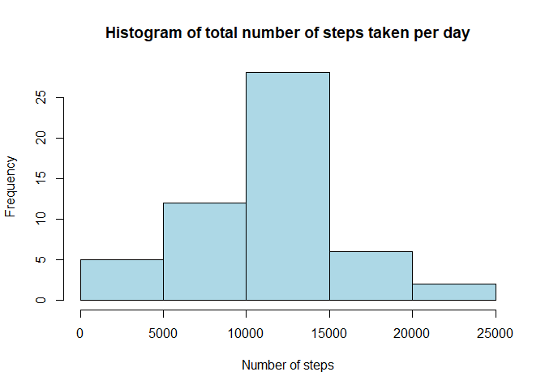
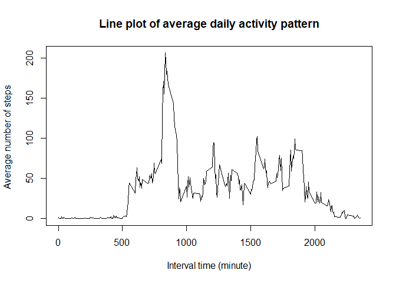
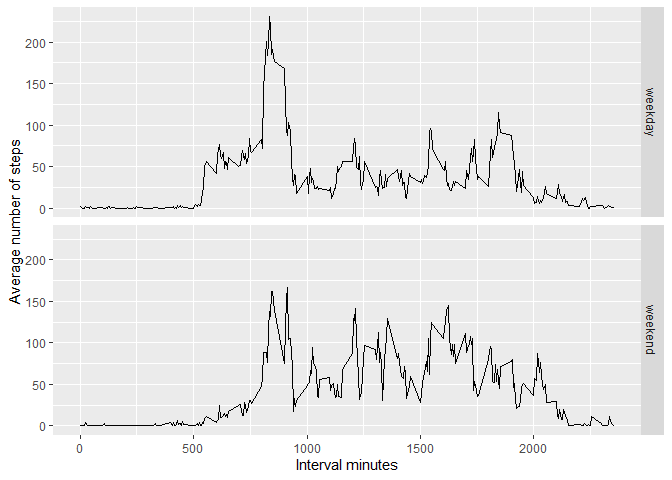

```r
rm(list=ls())
library(lubridate)
library(tidyr)
library(dplyr)
library(ggplot2)
```

## Loading and preprocessing the data


```r
unzip("activity.zip")

data <- read.csv("activity.csv")
str(data)
```

```
## 'data.frame':	17568 obs. of  3 variables:
##  $ steps   : int  NA NA NA NA NA NA NA NA NA NA ...
##  $ date    : chr  "2012-10-01" "2012-10-01" "2012-10-01" "2012-10-01" ...
##  $ interval: int  0 5 10 15 20 25 30 35 40 45 ...
```

```r
data <- transform(data,date = ymd(date))
```

## What is mean total number of steps taken per day?

```r
data_total <- data %>%
 group_by(date) %>%
        summarize(total_step=sum(steps))

hist(data_total$total_step,xlab="Number of steps",main="Histogram of total number of steps taken per day",col="lightblue")
```

<!-- -->

The mean and the median of the total number of steps taken per day are respectively :
 

```r
## Mean
round(mean(data_total$total_step,na.rm=TRUE))
```

```
## [1] 10766
```

```r
## Median
median(data_total$total_step,na.rm=TRUE)
```

```
## [1] 10765
```

## What is the average daily activity pattern?


```r
data_avg <- data %>%
 group_by(interval) %>%
        summarize(avg_step=mean(steps,na.rm = TRUE))

plot(data_avg$interval,data_avg$avg_step,xlab="Interval time (minute)",ylab="Average number of steps ",type="l",main="Line plot of average daily activity pattern")
```

<!-- -->

The maximum number of steps, averaged across all the days is :

```r
max(data_avg$avg_step)
```

```
## [1] 206.1698
```

The 5-minute interval associated to the maximum number of steps, averaged across all the days is :  

```r
data_avg$interval[which(data_avg$avg_step==max(data_avg$avg_step))]
```

```
## [1] 835
```


## Imputing missing values

The total number of missing values in the dataset is :

```r
sum(is.na(data))
```

```
## [1] 2304
```
The missing values will be replaced by the the mean for that 5-minute interval.


```r
data_imputed <- data

for (i in 1:nrow(data_imputed)) {
  if(is.na(data_imputed$steps[i])) {
    filling_value <- data_avg$avg_step[which(data_avg$interval 
                                              == data_imputed$interval[i])]
    data_imputed$steps[i] <- filling_value 
  }
}
```


```r
data_total_imputed <- data_imputed %>%
 group_by(date) %>%
        summarize(total_step=sum(steps))

hist(data_total$total_step,xlab="Number of steps",col="lightblue",main="Histogram of total number of steps taken per day")
```

<!-- -->

The mean and the median of the total number of steps taken per day are respectively :
 

```r
## Mean
round(mean(data_total_imputed$total_step,na.rm=TRUE))
```

```
## [1] 10766
```

```r
## Median
round(median(data_total_imputed$total_step,na.rm=TRUE))
```

```
## [1] 10766
```
Impact of imputing missing data: There is no impact to the mean and the median as the values are comparable.


## Are there differences in activity patterns between weekdays and weekends?


```r
data_imputed$weekdays <- 
  as.factor(ifelse(weekdays(data_imputed$date) %in% 
                     c("Saturday", "Sunday"), "weekend", "weekday"))
```


```r
 data_imputed %>%
 group_by(interval,weekdays) %>%
        summarize(mean_weekdays=mean(steps)) %>%
        ggplot(aes(interval,mean_weekdays)) +
        geom_line()+
        facet_grid(rows=vars(weekdays)) +
        labs(x="Interval minutes",y="Average number of steps")
```

```
## `summarise()` has grouped output by 'interval'. You can override using the
## `.groups` argument.
```

<!-- -->

The panel plot indicates differences in activity patterns between weekdays and weekends. Weekends, users start activity later than weekday and keep higher activity throughout the day than weekday.
